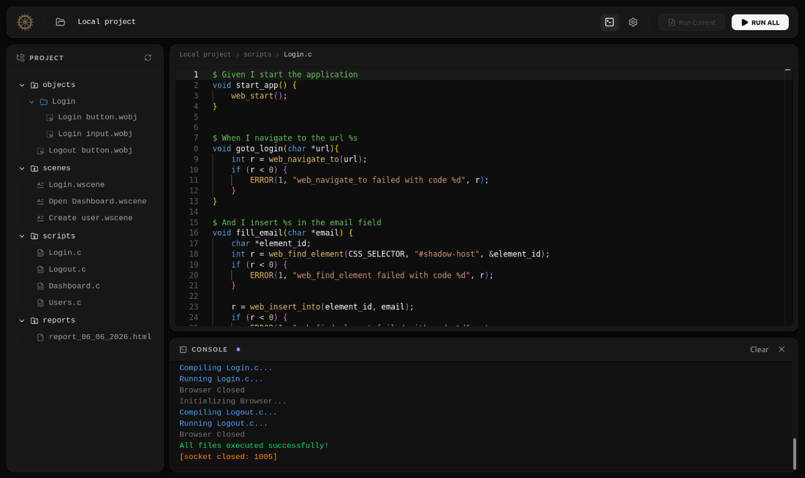

<div align="center">


# Nora-C

**A High-Performance C-Powered UI Automation & BDD Testing Platform**

[](https://en.wikipedia.org/wiki/C_(programming_language))
[](https://preactjs.com/)
[](https://vitejs.dev/)
[](https://microsoft.github.io/monaco-editor/)
[](https://tailwindcss.com/)
[](https://w3c.github.io/webdriver/)
[](LICENSE)

<br />

<p align="center">
  
</p>

*Nora-C in action: Monaco-powered web IDE, custom Gherkin step bindings in C, and live WebSocket streaming console.*

</div>

---

## 📖 Overview

**Nora-C** is a lightweight, blazing-fast UI test automation framework and IDE built from the ground up in **pure C**. It bridges the raw performance and low resource overhead of native C with a sleek, reactive web interface powered by Preact, Vite, and Monaco Editor.

Unlike traditional testing frameworks that depend heavily on bulky runtimes (Node.js, JVM, Python), Nora-C features its own **native C W3C WebDriver client library** (`webDriver/`), an embedded **Mongoose HTTP/WebSocket backend**, and a dynamic scenario compiler that maps human-readable BDD scenarios (`.wscene`) directly into compiled C execution routines.

---

## ✨ Features

- **⚡ Native C Performance:** Ultra-low latency test execution, minimal memory footprint, and instant startup times.
- **🌐 Built-in C W3C WebDriver Client:** Full-fledged standalone implementation of the W3C WebDriver specification (`webDriver/`), enabling direct communication with browser drivers such as GeckoDriver without external language bindings.
- **🥒 C-Native Behavior-Driven Development (BDD):** Write readable user journey scenarios in `.wscene` files and bind them seamlessly to C functions using `$` step annotations.
- **💻 Modern Web-Based IDE:** Integrated Preact + Vite interface featuring the Monaco Editor with C syntax highlighting, project tree management, and instant execution controls.
- **📡 Live WebSocket Streaming Console:** Real-time terminal feedback streaming compilation output, step execution status, and browser diagnostics over WebSockets (`/ws`).
- **🗂 Structured Project Model:** Clean separation of concerns with dedicated folders for element repositories (`objects/`), test workflows (`scenes/`), C step implementations (`scripts/`), and test outputs (`reports/`).
- **🔌 Dynamic Test Compilation:** Automatically extracts matching C step implementations, links against the Nora WebDriver library, compiles the test executable on the fly, and runs the suite seamlessly.

---

## 🏗 Architecture

```
┌─────────────────────────────────────────────────────────────┐
│                 Nora Web UI (Preact + Vite)                 │
│         Monaco Code Editor  •  File Tree  •  Live Logs      │
└──────────────┬───────────────────────────────▲──────────────┘
          HTTP │ REST                     WS   │ Streaming Logs
               ▼                               │
┌──────────────────────────────────────────────┴──────────────┐
│                    Nora-C Backend Core                      │
│     Mongoose Networking Server  •  Project Controller       │
│               Dynamic Scenario & C Step Linker              │
└──────────────┬──────────────────────────────────────────────┘
               │ Dynamic Compilation (gcc)
               ▼
┌─────────────────────────────────────────────────────────────┐
│                      Nora Test Runner                       │
│                   Native C Executable Suite                 │
└──────────────┬──────────────────────────────────────────────┘
               │ W3C WebDriver Protocol (HTTP/JSON via libcurl)
               ▼
┌─────────────────────────────────────────────────────────────┐
│         Browser Driver (e.g. GeckoDriver / Firefox)         │
└─────────────────────────────────────────────────────────────┘
```

The system is composed of four coordinated layers:
1. **Core Backend (`backend/`):** Handcrafted in C using **Mongoose**, serving static frontend assets, handling REST APIs for files/projects, and providing a high-speed WebSocket broadcast channel.
2. **Web IDE (`frontend/web/`):** A modern SPA built with Preact, Vite, Tailwind CSS, and Monaco Editor, offering full code editing capabilities and real-time execution controls.
3. **C WebDriver Library (`webDriver/`):** A standalone, fully-featured C client implementing W3C WebDriver endpoints using `libcurl` and `cJSON`.
4. **Dynamic Scenario Runner (`backend/controllers/run/`):** Reads `.wscene` scenarios, pairs steps with annotated functions in `scripts/*.c`, compiles the test binary, and executes it with live output streaming.

---

## 🎯 How BDD Testing Works in Nora-C

Nora-C combines Gherkin-like readability with the type safety and execution speed of C.

### 1. Scenario Definition (`scenes/Login.wscene`)
```gherkin
Given I start the application
When I navigate to the url "https://example.com/login"
And I insert "user@example.com" in the email field
```

### 2. C Step Definitions (`scripts/Login.c`)
Annotate C functions with `$` to bind them directly to scenario steps:

```c
#include "webDriver/src/core/web_core.h"

$ Given I start the application
void start_app() {
    web_start();
}

$ When I navigate to the url %s
void goto_login(char *url) {
    int r = web_navigate_to(url);
    if (r < 0) {
        ERROR(1, "web_navigate_to failed with code %d", r);
    }
}

$ And I insert %s in the email field
void fill_email(char *email) {
    char *element_id;
    int r = web_find_element(CSS_SELECTOR, "#email-input", &element_id);
    if (r < 0) {
        ERROR(1, "Element not found");
    }
    web_insert_into(element_id, email);
}
```

When you click **Run Current** or **RUN ALL**, Nora-C pairs the scene with the matching C routines, compiles the automation program, drives the browser, and pipes execution output straight to the Web UI console.

---

## 🛠 Prerequisites

Ensure your system has the following tools and libraries installed:

### Build Tools & Compilers
- **C Compiler:** `gcc` (or `clang`) with C11 / GNU11 support
- **Build System:** `make`
- **CLI Generator:** `gengetopt`
- **Frontend Tooling:** [Bun](https://bun.sh/) *(or Node.js 18+)*

### System Libraries (Debian / Ubuntu)
```bash
sudo apt-get update
sudo apt-get install -y \
    build-essential \
    gengetopt \
    libcurl4-openssl-dev \
    libcjson-dev
```

### Browser Automation Driver
- [GeckoDriver](https://github.com/mozilla/geckodriver/releases) (or your preferred W3C WebDriver server) accessible in your `PATH` or configured driver directory.

---

## 🚀 Quick Start

### 1. Clone & Build

Clone the repository and compile Nora-C (the Makefile automatically prepares the frontend assets and links the binary):

```bash
git clone https://github.com/redystum/Nora-c.git
cd Nora-c
make
```

### 2. Launch Nora-C

Run the application with default settings:

```bash
make run
```

*Nora-C will start the backend, spin up the HTTP/WebSocket servers, and open the Web IDE in your default browser.*

---

## ⚙️ CLI Configuration

You can customize hosts, ports, and launch behavior using command-line arguments:

| Option | Flag | Description | Default |
| :--- | :---: | :--- | :---: |
| `--fhost` | `-h` | Frontend Web UI Host | `localhost` |
| `--fport` | `-p` | Frontend Web UI Port | `3333` |
| `--bhost` | `-H` | Backend API Host | `localhost` |
| `--bport` | `-P` | Backend API Port | `8888` |
| `--sport` | `-s` | WebSocket Streaming Port | `8880` |
| `--open` | `-o` | Automatically open browser (`1` = yes, `0` = no) | `1` |

#### Example: Running with Custom Ports
```bash
./build/Nora --fport 4000 --bport 9000 --sport 9001
```
---

## 💻 Development Workflow

### Frontend Web IDE
For rapid UI iteration with Hot Module Replacement (HMR):

```bash
cd frontend/web
bun install
bun run dev
```

### Backend & C Core
Compile with debugging symbols and verbose logging:

```bash
make debugon
make run
```

Or build an optimized production build:

```bash
make optimize
```

---

## 📝 Technical Notes & Credits

- **Native C Backend:** The core backend, scenario parsing engine, and W3C WebDriver implementation are 100% handwritten in C by [Rúben Alves](https://github.com/redystum).
- **Networking:** Powered by [Cesanta Mongoose](https://cesanta.com/) embedded networking library.
- **Frontend:** Built with Preact, Vite, Tailwind CSS, and Microsoft Monaco Editor.

---

## 📄 License

Distributed under the **MIT License**. See [`LICENSE`](LICENSE) for complete terms.